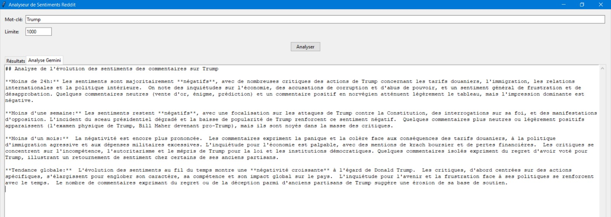

PIERRON Marie et BACHER Quentin

Ce projet propose une application permettant d'analyser automatiquement les sentiments des publications Reddit en fonction d'un mot-clé donné. L'application identifie si les opinions exprimées dans les posts sont positives, négatives ou neutres, et génère une synthèse complète de l'évolution des sentiments à l'aide de Google Gemini. Une interface graphique, construite avec Tkinter, permet de saisir le mot-clé à analyser ainsi que le nombre de posts à traiter (positif, négatif, neutre).

Technologies utilisées : 
- PRAW pour interagir avec Reddit.
- TextBlob pour l'analyse de sentiment.
- Google Gemini pour générer une synthèse.
- Plotly pour les graphiques.
- Tkinter pour l'interface utilisateur.

Exemple de résultat du programme : 

  
  

Faire fonctionner l'outil : 

Pour installer touts les packages nécessaires, il est possible d'exécuter la commande suivante dans votre terminal :
pip install praw google-generativeai matplotlib plotly textblob tkinter

Avant de pouvoir utiliser l'application, il est nécessaire d'avoir vos propres identifiants personnels. Vous devez d'abord créer un compte Reddit puis obtenir vos clés API Reddit. Pour cela, rendez-vous sur https://www.reddit.com/prefs/apps.. Une fois l'application créée, récupérez votre client_id, votre client_secret, ainsi que votre username et password. Ces informations doivent être renseignées directement dans le code, dans la section prévue à cet effet.

Ensuite, il faut également disposer d'une clé API Google Gemini. Pour cela, allez sur https://ai.google.dev/, connectez-vous avec un compte Google, activez l'API Gemini, et générez votre clé API personnelle. Cette clé est à renseigner également dans le code dans la ligne genai.configure(api_key="VOTRE_CLE_API_GEMINI").

Une fois toutes les informations personnels renseigner dans le code, il suffit de lancer le script Python. Une interface graphique s'ouvrira alors. Vous pourrez saisir le mot-clé que vous souhaitez analyser et spécifier le nombre de posts Reddit que vous souhaitez prendre en compte (par défaut, 1000 posts). Après avoir cliqué sur "Analyser", l'application va :

1. Récupérer les publications Reddit correspondant au mot-clé,

2. Effectuer une analyse de sentiment sur chaque publication,

3. Générer une synthèse de l'évolution des sentiments avec Google Gemini,

4. Afficher les résultats dans un tableau et une jauge graphique indiquant la répartition des sentiments.
